# Internship Management System

A comprehensive Django-based platform for hospitals and organisations to manage the full lifecycle of internship programs — from onboarding and attendance tracking to performance evaluations and reporting.

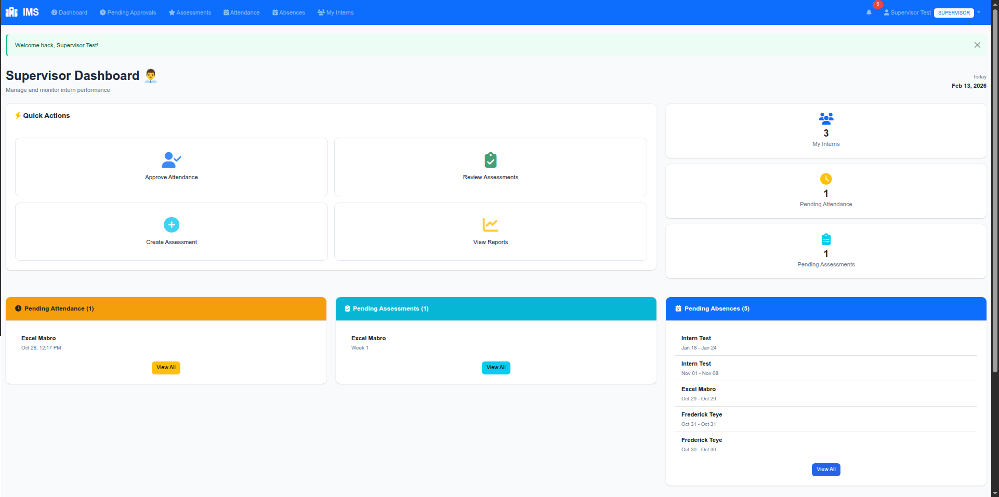

---

## Table of Contents

- [Features](#features)
- [Screenshots](#screenshots)
- [Architecture](#architecture)
- [Tech Stack](#tech-stack)
- [Getting Started](#getting-started)
- [Configuration](#configuration)
- [Usage](#usage)
- [Testing](#testing)
- [Project Structure](#project-structure)
- [Contributing](#contributing)
- [License](#license)

---

## Features

### User Management & Onboarding

- Custom user model with **5 roles**: Administrator, Manager, Supervisor, Employee, and Intern
- Secure onboarding with time-bound invitation tokens
- Role-based access control across the entire platform
- Profile management with photo uploads

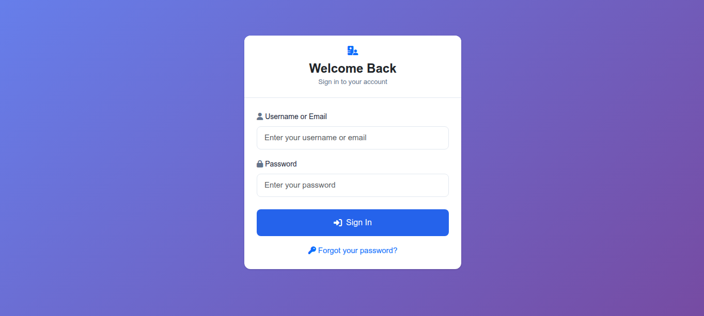

### Role-Based Dashboards

- **Admin Dashboard** — System-wide statistics, user management, and configuration
- **Manager Dashboard** — Cross-branch oversight, all pending approvals, and activity feeds
- **Supervisor Dashboard** — Assigned intern management, pending approvals, and recent activity
- **Employee Dashboard** — Basic employee information and task overview
- **Intern Dashboard** — Personal attendance stats, assessment scores, and pending items

| Supervisor Dashboard                                               | Intern Dashboard                                           |
| ------------------------------------------------------------------ | ---------------------------------------------------------- |
| 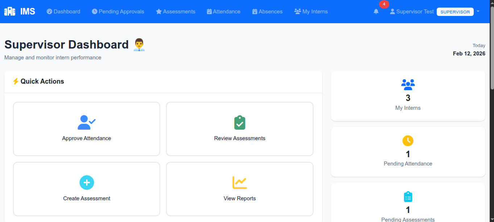 | 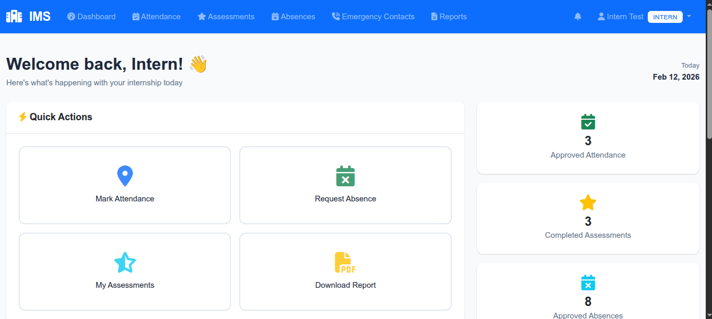 |

### GPS-Based Attendance Tracking

- HTML5 Geolocation-powered check-in/check-out
- Automatic approval using **Haversine distance** calculation against branch coordinates
- Manual supervisor approval workflow for out-of-range check-ins
- Complete attendance history with filtering

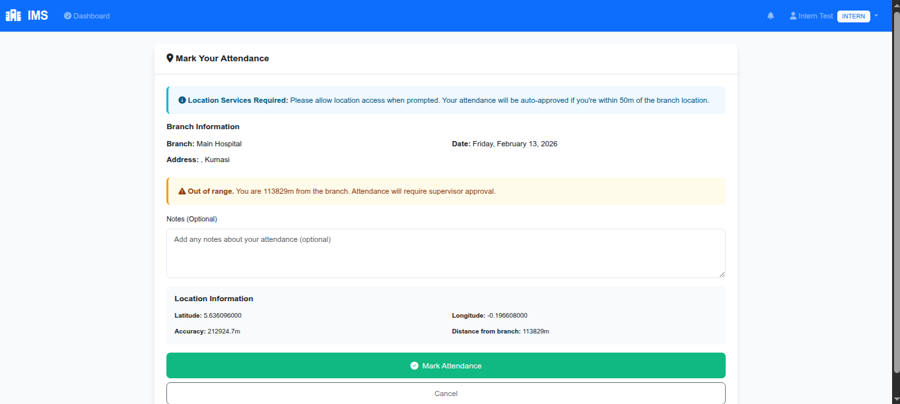

### Performance Assessments

- **Dual-perspective evaluations** — supervisor assessments and intern self-assessments
- Scoring system (0–100) with status tracking (Draft → Submitted → Reviewed)
- Weekly/periodic assessment workflows
- Assessment history and performance statistics

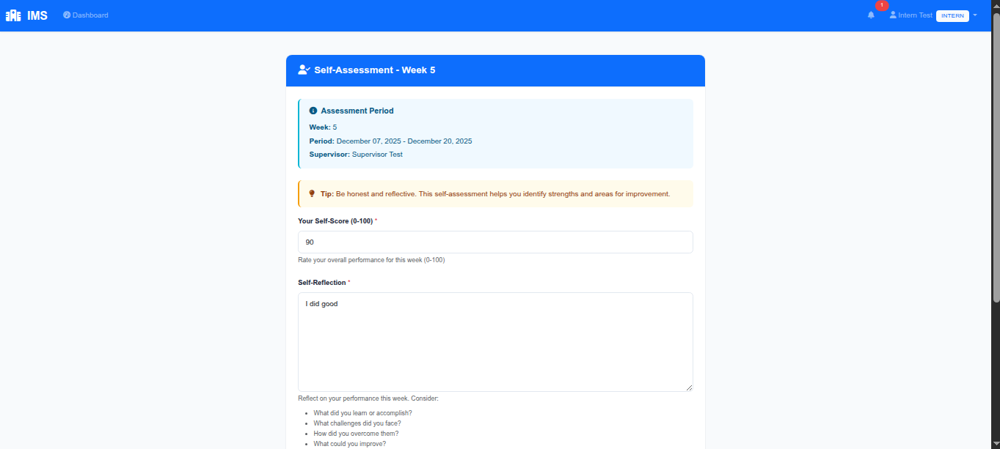

### Absenteeism Management

- Absence request submission with date ranges and supporting document uploads
- Approval/rejection workflow for supervisors
- Request cancellation by interns
- Complete request history

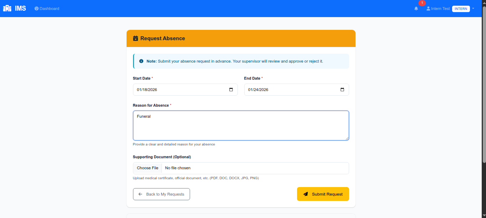

### Notification System

- In-app notifications with read/unread status
- **Email notifications** via professional HTML templates
- Granular user notification preferences
- Automatic triggers for attendance, assessments, absences, and onboarding events

### Intern History & Search

- Searchable intern directory with advanced filtering (status, branch, school)
- Complete intern history view — assessments, attendance, and absence records
- Performance metrics for hiring decisions

| Intern List                                      | Intern Detail                                        |
| ------------------------------------------------ | ---------------------------------------------------- |
| 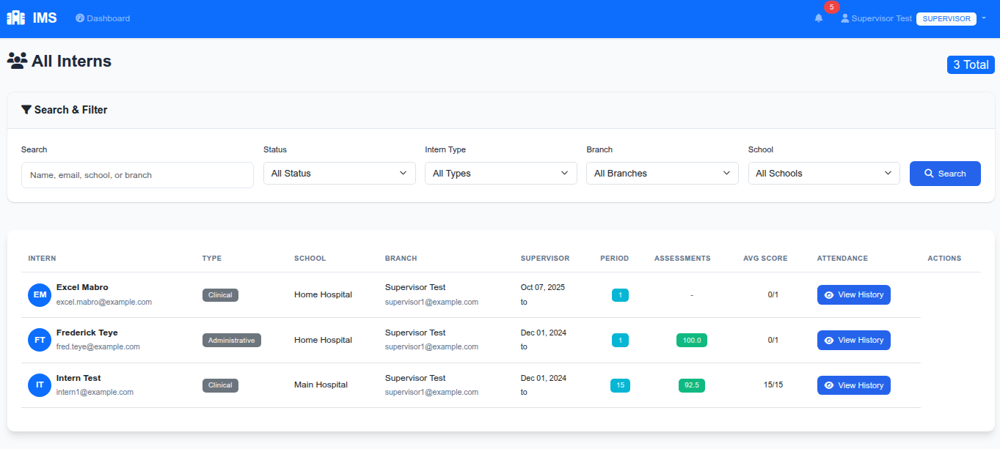 | 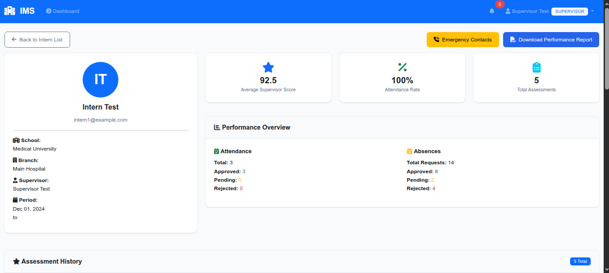 |

### Branch & School Management

- Multi-branch support with GPS coordinates for attendance validation
- School and academic supervisor records
- Branch employee assignments

### Reporting

- Intern performance reports
- PDF report generation via WeasyPrint

### Additional Features

- Holiday calendar management
- Activity logging and audit trails
- Responsive UI with Bootstrap 5
- Docker-ready deployment

---

## Screenshots

All screenshots are stored in `docs/screenshots/`. To add your own, take screenshots of each page and save them with the filenames listed below.

### Login & Onboarding

| Login Page                           | Onboarding                                     |
| ------------------------------------ | ---------------------------------------------- |
|  | 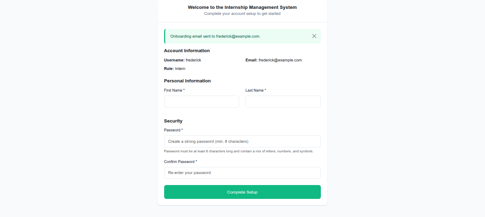 |

### Dashboards

| Admin Dashboard                                          | Manager Dashboard                                            |
| -------------------------------------------------------- | ------------------------------------------------------------ |
| 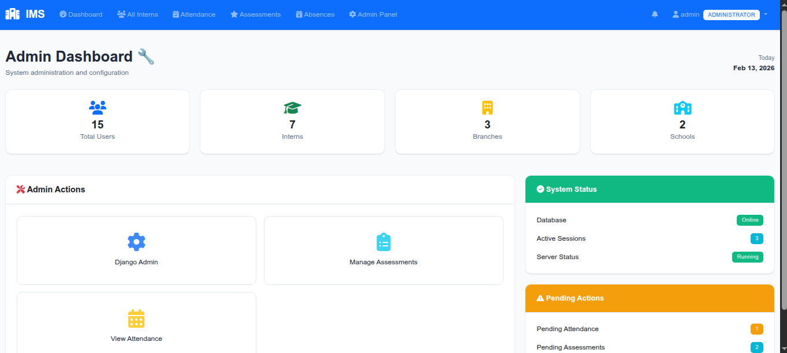 | 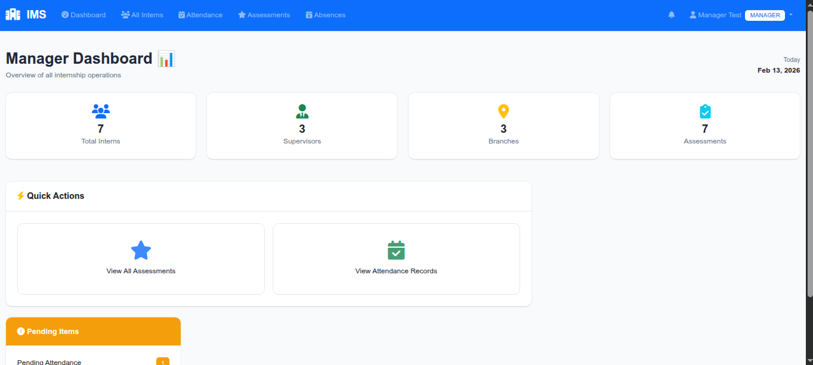 |

| Supervisor Dashboard                                               | Intern Dashboard                                           |
| ------------------------------------------------------------------ | ---------------------------------------------------------- |
|  |  |

### Attendance

| Check-in (GPS)                                       | Attendance History                                             |
| ---------------------------------------------------- | -------------------------------------------------------------- |
|  | 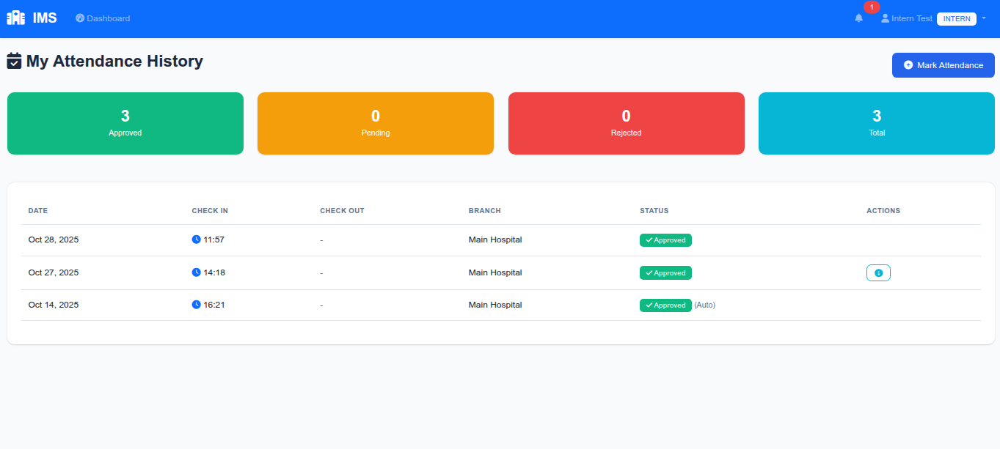 |

### Assessments

| Create Assessment                                          | Assessment Review                                            |
| ---------------------------------------------------------- | ------------------------------------------------------------ |
|  | 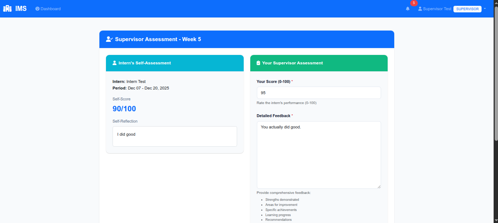 |

### Absenteeism

| Request Absence                                          | Request List                                       |
| -------------------------------------------------------- | -------------------------------------------------- |
|  |  |

### Intern Management

| Intern Directory                                 | Intern Profile & History                             |
| ------------------------------------------------ | ---------------------------------------------------- |
|  |  |

### Notifications

| Notification Centre                                              | Email Notification                                             |
| ---------------------------------------------------------------- | -------------------------------------------------------------- |
| 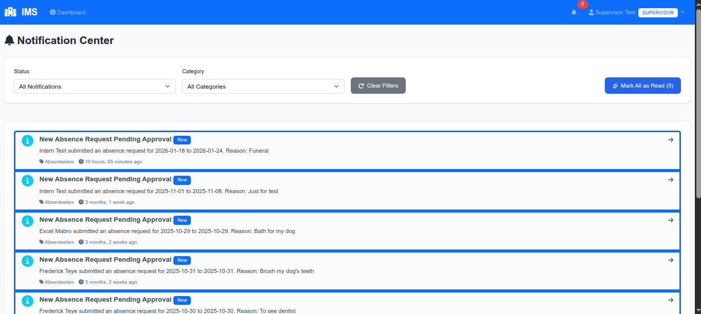 |  |

### Reports

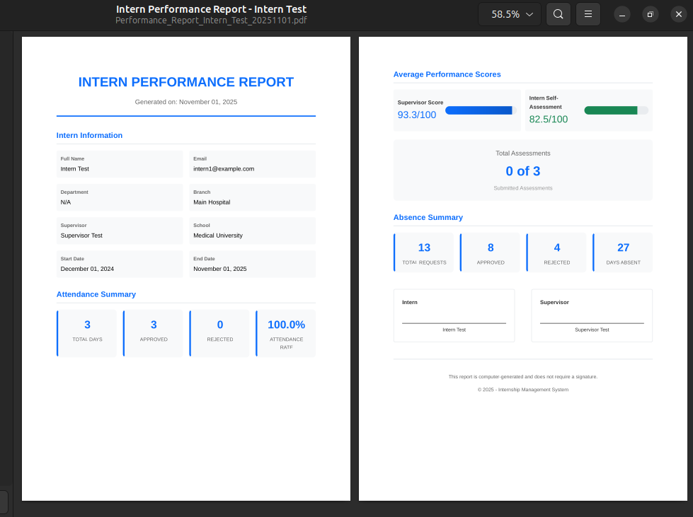

---

## Architecture

The system is built with a **modular Django app architecture** with 12 specialised apps:

```
apps/
├── accounts/        # Authentication, user model, onboarding
├── dashboards/      # Role-based dashboard views
├── interns/         # Intern profiles, search, history
├── supervisors/     # Employee/supervisor profiles
├── attendance/      # GPS check-in/out, approvals
├── evaluations/     # Performance assessments
├── absenteeism/     # Absence requests & workflows
├── notifications/   # In-app & email notifications
├── branches/        # Branch management & assignments
├── schools/         # Schools & academic supervisors
├── holidays/        # Holiday calendar
└── reports/         # Report generation
```

See [ARCHITECTURE.md](ARCHITECTURE.md) for the full technical documentation.

---

## Tech Stack

| Layer                | Technology                               |
| -------------------- | ---------------------------------------- |
| **Backend**          | Django 4.2 (Python 3.11)                 |
| **Database**         | PostgreSQL 15                            |
| **Frontend**         | Bootstrap 5, django-crispy-forms         |
| **GPS**              | HTML5 Geolocation API, geopy (Haversine) |
| **PDF Generation**   | WeasyPrint                               |
| **Image Processing** | Pillow                                   |
| **Containerisation** | Docker & Docker Compose                  |

---

## Getting Started

### Prerequisites

- **Docker** and **Docker Compose** (recommended), or
- **Python 3.11+** and **PostgreSQL 15** for local development

### Quick Start with Docker

```bash
# Clone the repository
git clone https://github.com/your-username/internship_management_system.git
cd internship_management_system

# Set up environment variables
cp .env.example .env
# Edit .env with your database credentials and secret key

# Build and run
docker-compose up --build
```

The application will be available at **http://localhost:8000**.

### Run Locally (without Docker)

```bash
# Create and activate virtual environment
python -m venv .venv
source .venv/bin/activate

# Install dependencies
pip install -r requirements.txt

# Set up environment variables
cp .env.example .env

# Run database migrations
python manage.py migrate

# Create a superuser
python manage.py createsuperuser

# Start the development server
python manage.py runserver
```

---

## Configuration

### Environment Variables

Create a `.env` file from `.env.example` and configure the following:

| Variable               | Description        | Default                 |
| ---------------------- | ------------------ | ----------------------- |
| `DJANGO_SECRET_KEY`    | Django secret key  | —                       |
| `DJANGO_DEBUG`         | Enable debug mode  | `false`                 |
| `POSTGRES_DB`          | Database name      | `internship_management` |
| `POSTGRES_USER`        | Database user      | —                       |
| `POSTGRES_PASSWORD`    | Database password  | —                       |
| `POSTGRES_HOST`        | Database host      | `db`                    |
| `POSTGRES_PORT`        | Database port      | `5432`                  |
| `DJANGO_EMAIL_BACKEND` | Email backend      | `console`               |
| `EMAIL_HOST`           | SMTP host          | —                       |
| `EMAIL_PORT`           | SMTP port          | `587`                   |
| `EMAIL_HOST_USER`      | SMTP username      | —                       |
| `EMAIL_HOST_PASSWORD`  | SMTP password      | —                       |
| `DJANGO_LOG_DIR`       | Log file directory | auto-detected           |

### Logging

- Console output mirrors all log events in real time when running with `docker-compose up`
- File-based logs are written to `application.log` in a writable directory (override with `DJANGO_LOG_DIR`)

---

## Usage

### Creating Users

1. Log in to the **Django Admin** at `/admin/` with your superuser account
2. Create users and assign roles (Admin, Manager, Supervisor, Employee, Intern)
3. Send onboarding invitations to new users — they'll receive time-bound tokens to complete setup

### Typical Workflow

1. **Admin** creates branches, schools, and holiday calendars
2. **Manager/Admin** onboards supervisors and interns
3. **Interns** check in/out daily using GPS — attendance is auto-approved if within branch proximity
4. **Supervisors** review out-of-range attendance, create performance assessments, and handle absence requests
5. **Interns** submit self-assessments and absence requests with supporting documents
6. **Managers** view cross-branch reports and system-wide statistics

---

## Testing

```bash
# Run the full test suite
python manage.py test tests/

# Run specific test modules
python manage.py test tests.test_models
python manage.py test tests.test_views
python manage.py test tests.test_forms

# Run with the helper script
./scripts/run_tests.sh
```

---

## Project Structure

```
internship_management_system/
├── config/                  # Django project configuration
│   ├── settings.py          # Application settings
│   ├── urls.py              # Root URL routing
│   ├── middleware.py         # Activity logging middleware
│   └── admin_views.py       # Custom admin views
├── apps/                    # Django applications (12 modules)
├── templates/               # HTML templates (organized by app)
├── static/css/              # Stylesheets
├── media/                   # User uploads (gitignored)
├── tests/                   # Test suite
├── scripts/                 # Utility scripts
├── docs/                    # Documentation
├── Dockerfile               # Application container
├── docker-compose.yml       # Multi-service orchestration
├── requirements.txt         # Python dependencies
└── manage.py                # Django management CLI
```

---

## Contributing

1. Fork the repository
2. Create a feature branch (`git checkout -b feature/your-feature`)
3. Commit your changes (`git commit -m 'Add your feature'`)
4. Push to the branch (`git push origin feature/your-feature`)
5. Open a Pull Request

---

## License

This project is licensed under the [MIT License](LICENSE).
